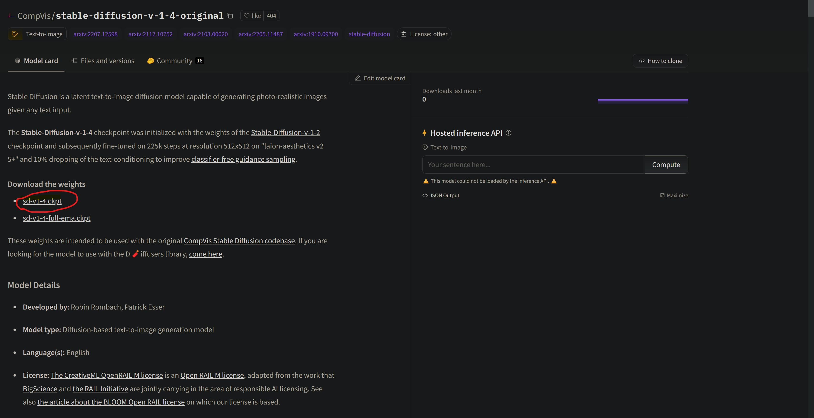

# Stable Diffusion GUI tutorial (for now Windows only)
### Step 0. Download the packed GUI
To get the binary, 
[download this](https://www.mediafire.com/file/k4ima9tb03ebrnp/StableDiffusionGui.zip/file) (4 gb).<br>

### Step 1. 
Extract the downloaded archive.


Also, to download the weights, go [here](https://huggingface.co/CompVis/stable-diffusion-v-1-4-original), and download this:



Rename it to `model.ckpt`

Put the `model.ckpt` file to `StableDiffusionGui\_internal\stable_diffusion\models\ldm\stable-diffusion-v1`

run the `2) download weights if not exist.bat` file to check if the weights are place in the right location.


also install git if not installed
https://git-scm.com/downloads

### Step 2. 
Your folder contents should look like this


### Step 3. 
run the 
```
1) install.bat
```
file. It should produce the output as in the screenshot.


### Step 4.1

`
PEACASSO_GUI) run peacasso GUI.bat
`

<br> Utilizes the peacasso gui, which looks like this:


### Step 4.2
Each file explained:

``` SD_FAST) run vanilla txt2img.bat ``` is used to run the txt2img gradio interface. after double-clicking it, go to step 5.

```SD_FAST) run vanilla img2img.bat``` is used to run the img2img gradio interface. after double-clicking it, go to step 5.

```SD_FAST) run vanilla img2img inpainting.bat``` is used to run the img2img inpainting gradio interface. after double-clicking it, go to step 5.

<br> If you are limited by resources or want to generate bigger-resolution images, go to step 4.3.

### Step 4.3
Obviously the same as 4.2 but slower, though allows to generate much higher-resolution images, see [the comparison table](https://github.com/neonsecret/stable-diffusion#:~:text=Below%20you%20can%20see%20the%20comparison%20table.).

### Step 4.3
If you encounter this error, just press 'OK', it doesn't mean anything.<br>


### Step 5
After clicking one of the 6 .bat files, you should see output like this.
<br>
Choose the red link in 99% cases.
Choose the blue one if you have troubles with the red one. They  lead to the same page.
Copy your link of choice and paste it into your web-browser. (Chrome Firefox whatever)


### Step +. Gradio interface explained.
Once you open the page, you should see interface like this. It may vary because each mode has it's interface. 

Though I think it's intuitive, I will explain some of the params:
- ddm_steps: usally 50 is the fine value, lower it if you want faster results
- n_iter: number of generated images, will appear in a grid.
- scale: how much your prompt will influence the image, experiment with it
- turbo: if you have memory errors, try disabling it.
- sampler: different sampler may produce a bit different results.
- speed_mp: the more the slower, but the bigger images you can produce. Typically 2-5 are fine values.

<br>
Other params are better to be left as-is.


